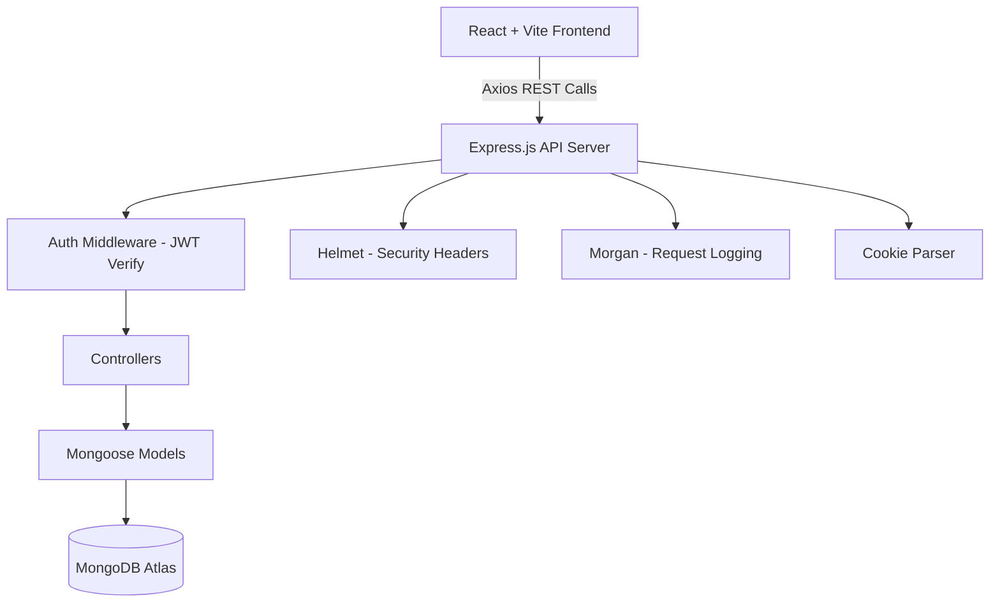
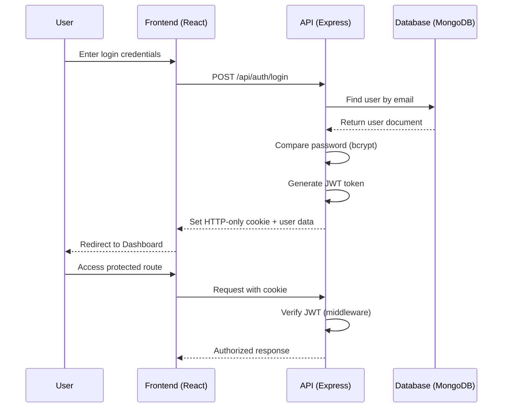
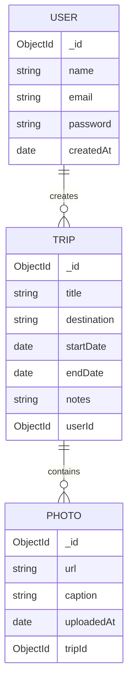

[README-4.md](https://github.com/user-attachments/files/29713541/README-4.md)
<div align="center">

<!-- BANNER PLACEHOLDER -->


<!-- LOGO PLACEHOLDER -->
<br/>


# 🧳 TripVault

### *Every Journey Deserves a Vault.*

<!-- ANIMATED TYPING HEADER -->


<br/><br/>

<!-- BADGES -->


<br/>

[Live Demo](#) · [Report Bug](#) · [Request Feature](#) · [Documentation](#)

</div>

<br/>

---

## 📖 Introduction

**TripVault** is a modern, full-stack web application built for one purpose only — **helping travelers organize, preserve, and relive their travel memories**, beautifully and completely.

It is **not** a photo backup tool. It is **not** another cloud gallery. TripVault is a dedicated **memory management system** for your journeys — where every trip becomes a living vault of photos, notes, details, and moments, organized on a timeline you'll actually want to revisit.

> 💡 **In short:** Google Photos stores your pictures. TripVault stores your *journeys*.

<br/>

---

## 🤔 Why TripVault?

<table>
<tr>
<td width="50%" valign="top">

### 📷 Google Photos & Others
- Photos dumped into one giant, chronological pool
- No concept of a "trip" as a unit
- No place for travel notes, trip details, or context
- Memories get lost in a sea of unrelated images
- Zero storytelling — just a grid of thumbnails

</td>
<td width="50%" valign="top">

### 🧳 TripVault
- Every trip is its own **organized vault**
- Photos, notes, and details grouped by **destination**
- A real **timeline** that tells the story of your journey
- Built **only** for travel — no clutter, no distractions
- One dashboard to relive **every** adventure you've had

</td>
</tr>
</table>

> **The core idea:** A photo without context is just a file. A photo with a destination, a date, a note, and a story — that's a *memory*. TripVault exists to preserve the memory, not just the media.

<br/>

---

## ✨ Features

<details open>
<summary><b>🔐 Authentication</b></summary>
<br/>

| Feature | Description |
|---|---|
| Secure Signup/Login | JWT-based authentication system |
| Encrypted Passwords | Passwords hashed using `bcrypt` |
| Persistent Sessions | Secure HTTP-only cookies |
| Protected Routes | Middleware-guarded API and pages |

</details>

<details open>
<summary><b>🧳 Trips</b></summary>
<br/>

| Feature | Description |
|---|---|
| Unlimited Trips | Create as many trips as you want, forever |
| Destination Grouping | Organize trips by city, country, or region |
| Trip Details | Store dates, companions, budget notes, and descriptions |
| Travel Notes | Freeform journal-style notes per trip |
| Edit & Delete | Full CRUD control over every trip |

</details>

<details open>
<summary><b>🖼️ Photos</b></summary>
<br/>

| Feature | Description |
|---|---|
| Bulk Upload | Upload multiple photos per trip at once |
| Auto-Grouping | Photos automatically linked to their trip |
| Gallery View | Clean, responsive photo grid per trip |
| Memory Timeline | Chronological visual story of your travels |

</details>

<details open>
<summary><b>📊 Dashboard</b></summary>
<br/>

| Feature | Description |
|---|---|
| Unified View | All trips and memories in one place |
| Quick Stats | Total trips, photos, and destinations at a glance |
| Recent Activity | Jump back into your latest trip instantly |
| Responsive Design | Fully functional across desktop and mobile |

</details>

<details open>
<summary><b>🛡️ Security</b></summary>
<br/>

| Feature | Description |
|---|---|
| JWT Authentication | Stateless, secure token-based auth |
| HTTP-only Cookies | Protection against XSS token theft |
| Helmet.js | Secure HTTP headers by default |
| Input Validation | Sanitized requests across all endpoints |

</details>

<details open>
<summary><b>🤖 Future AI Features</b></summary>
<br/>

| Feature | Description |
|---|---|
| AI Trip Journal | Auto-generated journal entries from trip data |
| AI Story Generator | Turn your photos + notes into a narrated story |
| AI Caption Generator | Smart captions for every uploaded photo |
| Memory Search | Natural language search across all your trips |

</details>

<br/>

---

## 🖼️ Screenshots

<div align="center">

| Landing Page | Dashboard |
|:---:|:---:|
|  |  |

| Create Trip | Trip Gallery |
|:---:|:---:|
|  |  |

| Memory Timeline | Profile |
|:---:|:---:|
|  |  |

</div>

> 📌 *Replace the placeholder paths above with actual screenshots inside an `/assets/screenshots` folder.*

<br/>

---

## 🗂️ Folder Structure

<details>
<summary><b>📁 Click to expand full project structure</b></summary>

```bash
TripVault/
├── backend/
│   ├── config/
│   │   └── db.js
│   ├── controllers/
│   │   ├── authController.js
│   │   ├── tripController.js
│   │   ├── photoController.js
│   │   └── profileController.js
│   ├── middleware/
│   │   ├── authMiddleware.js
│   │   └── errorMiddleware.js
│   ├── models/
│   │   ├── User.js
│   │   ├── Trip.js
│   │   └── Photo.js
│   ├── routes/
│   │   ├── authRoutes.js
│   │   ├── tripRoutes.js
│   │   ├── photoRoutes.js
│   │   └── profileRoutes.js
│   ├── utils/
│   │   └── generateToken.js
│   ├── uploads/
│   ├── .env.example
│   ├── server.js
│   └── package.json
│
├── frontend/
│   ├── public/
│   ├── src/
│   │   ├── assets/
│   │   ├── components/
│   │   │   ├── Navbar.jsx
│   │   │   ├── TripCard.jsx
│   │   │   ├── PhotoGrid.jsx
│   │   │   └── Timeline.jsx
│   │   ├── context/
│   │   │   └── AuthContext.jsx
│   │   ├── pages/
│   │   │   ├── Landing.jsx
│   │   │   ├── Dashboard.jsx
│   │   │   ├── CreateTrip.jsx
│   │   │   ├── TripGallery.jsx
│   │   │   ├── MemoryTimeline.jsx
│   │   │   └── Profile.jsx
│   │   ├── services/
│   │   │   └── api.js
│   │   ├── App.jsx
│   │   └── main.jsx
│   ├── .env.example
│   ├── index.html
│   ├── vite.config.js
│   └── package.json
│
├── assets/
│   ├── banner.png
│   ├── logo.png
│   └── screenshots/
│
├── LICENSE
└── README.md
```

</details>

<br/>

---

## ⚙️ Installation

### 1️⃣ Clone the Repository

```bash
git clone https://github.com/your-username/tripvault.git
cd tripvault
```

### 2️⃣ Backend Setup

```bash
cd backend
npm install
```

### 3️⃣ Frontend Setup

```bash
cd ../frontend
npm install
```

### 4️⃣ Configure Environment Variables

Create a `.env` file in both `backend/` and `frontend/` (see below).

### 5️⃣ Run the Backend

```bash
cd backend
npm run dev
```

### 6️⃣ Run the Frontend

```bash
cd frontend
npm run dev
```

> ✅ Backend runs on `http://localhost:5000` · Frontend runs on `http://localhost:5173`

<br/>

---

## 🔑 Environment Variables

<table>
<tr><th colspan="2">🖥️ Backend — <code>backend/.env</code></th></tr>
<tr><td><code>PORT</code></td><td>Port for the Express server (e.g. <code>5000</code>)</td></tr>
<tr><td><code>MONGO_URI</code></td><td>MongoDB connection string</td></tr>
<tr><td><code>JWT_SECRET</code></td><td>Secret key for signing JWT tokens</td></tr>
<tr><td><code>CLIENT_URL</code></td><td>Frontend origin URL for CORS</td></tr>
</table>

```env
PORT=5000
MONGO_URI=your_mongodb_connection_string
JWT_SECRET=your_super_secret_key
CLIENT_URL=http://localhost:5173
```

<table>
<tr><th colspan="2">💻 Frontend — <code>frontend/.env</code></th></tr>
<tr><td><code>VITE_API_URL</code></td><td>Base URL of the backend API</td></tr>
</table>

```env
VITE_API_URL=http://localhost:5000/api
```

> ⚠️ **Never commit your `.env` files.** Use the provided `.env.example` templates instead.

<br/>

---

## 🔌 API Endpoints

<details>
<summary><b>🔐 Authentication</b></summary>
<br/>

| Method | Endpoint | Description | Protected |
|---|---|---|---|
| `POST` | `/api/auth/register` | Register a new user | ❌ |
| `POST` | `/api/auth/login` | Login and receive JWT | ❌ |
| `POST` | `/api/auth/logout` | Logout and clear cookie | ✅ |
| `GET`  | `/api/auth/me` | Get current logged-in user | ✅ |

</details>

<details>
<summary><b>🧳 Trips</b></summary>
<br/>

| Method | Endpoint | Description | Protected |
|---|---|---|---|
| `GET`    | `/api/trips` | Get all trips for logged-in user | ✅ |
| `POST`   | `/api/trips` | Create a new trip | ✅ |
| `GET`    | `/api/trips/:id` | Get a single trip by ID | ✅ |
| `PUT`    | `/api/trips/:id` | Update trip details | ✅ |
| `DELETE` | `/api/trips/:id` | Delete a trip | ✅ |

</details>

<details>
<summary><b>🖼️ Photos</b></summary>
<br/>

| Method | Endpoint | Description | Protected |
|---|---|---|---|
| `POST`   | `/api/trips/:id/photos` | Upload photos to a trip | ✅ |
| `GET`    | `/api/trips/:id/photos` | Get all photos for a trip | ✅ |
| `DELETE` | `/api/photos/:photoId` | Delete a specific photo | ✅ |

</details>

<details>
<summary><b>👤 Profile</b></summary>
<br/>

| Method | Endpoint | Description | Protected |
|---|---|---|---|
| `GET` | `/api/profile` | Get user profile & stats | ✅ |
| `PUT` | `/api/profile` | Update profile information | ✅ |

</details>

<br/>

---

## 🏗️ Architecture

### Application Architecture



### Authentication Flow



### Database Relationship



<br/>

---

## 🚀 Future Features

<table>
<tr>
<td>🧠 AI Trip Journal</td>
<td>✍️ AI Story Generator</td>
<td>📊 Travel Statistics</td>
</tr>
<tr>
<td>🗺️ Map Integration</td>
<td>💰 Expense Tracker</td>
<td>🌦️ Weather History</td>
</tr>
<tr>
<td>🤝 Shared Trips</td>
<td>📴 Offline Mode</td>
<td>☁️ Cloud Backup</td>
</tr>
<tr>
<td>🎥 Video Memories</td>
<td>🎬 Travel Reels</td>
<td>🏷️ AI Caption Generator</td>
</tr>
<tr>
<td>😊 Face Recognition</td>
<td>🔍 Memory Search</td>
<td>👥 Trip Collaboration</td>
</tr>
</table>

<br/>

---

## ☁️ Deployment

| Layer | Platform | Notes |
|---|---|---|
| **Frontend** | [Vercel](https://vercel.com) | Auto-deploy from `main` branch |
| **Backend** | [Render](https://render.com) | Node.js web service |
| **Database** | [MongoDB Atlas](https://www.mongodb.com/atlas) | Managed cloud MongoDB cluster |

> 🔧 Remember to set your environment variables in each platform's dashboard before deploying.

<br/>

---

## 🛡️ Security

TripVault is built with security as a first-class concern:

- 🔐 **JWT Authentication** — stateless, signed tokens for every session
- 🔒 **Password Hashing** — all passwords hashed with `bcrypt` before storage
- 🚧 **Protected Routes** — middleware guards on every sensitive endpoint
- 🌐 **HTTPS Enforced** — secure transport in production environments
- 🪖 **Helmet.js** — secure HTTP headers out of the box
- 🍪 **HTTP-only Cookies** — tokens never exposed to client-side JavaScript

<br/>

---

## 🤝 Contributing

Contributions are what make the open-source community amazing. Any contribution you make is **greatly appreciated**.

1. **Fork** the repository
2. **Clone** your fork
   ```bash
   git clone https://github.com/your-username/tripvault.git
   ```
3. **Create a branch**
   ```bash
   git checkout -b feature/AmazingFeature
   ```
4. **Commit your changes**
   ```bash
   git commit -m "Add: AmazingFeature"
   ```
5. **Push to your branch**
   ```bash
   git push origin feature/AmazingFeature
   ```
6. **Open a Pull Request** and describe your changes clearly

> 📋 Please check open issues before starting work to avoid duplicate efforts.

<br/>

---

## 📄 License

This project is licensed under the **MIT License**.
See the [`LICENSE`](./LICENSE) file for full details.

<br/>

---

## 👤 Author

<div align="center">

**Your Name Here**

[](https://github.com/your-username)
[](https://linkedin.com/in/your-profile)
[](https://your-portfolio.com)
[](mailto:your-email@example.com)

</div>

<br/>

---

## 💖 Support

If TripVault helped you organize your memories or inspired your own project, consider giving it a ⭐ — it truly helps!

<div align="center">

**Made with ❤️ for travelers who never want to forget.**

### ⭐ Star History

<a href="https://star-history.com/#your-username/tripvault&Date">
  
</a>

<br/><br/>

*"Every Journey Deserves a Vault."* 🧳

</div>
